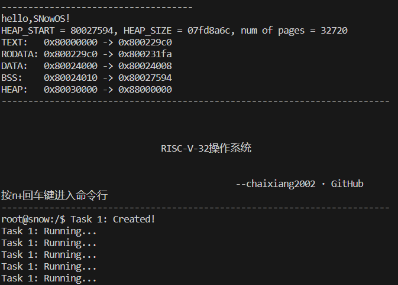
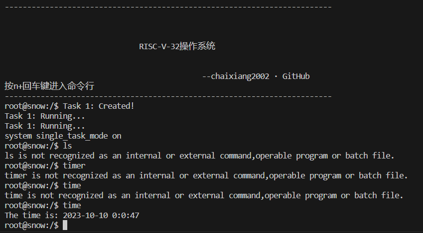
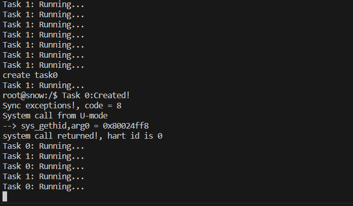
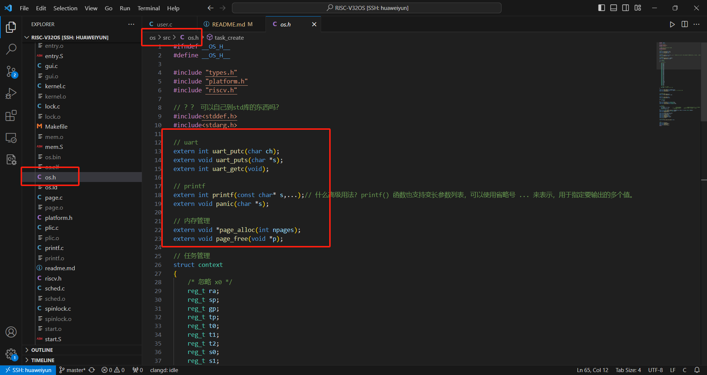
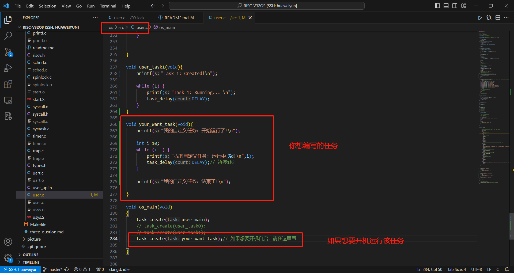
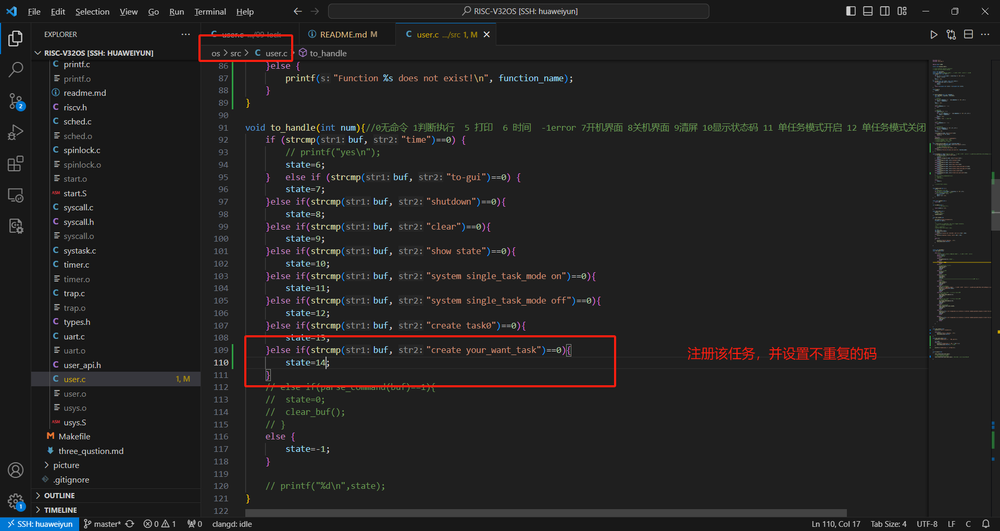
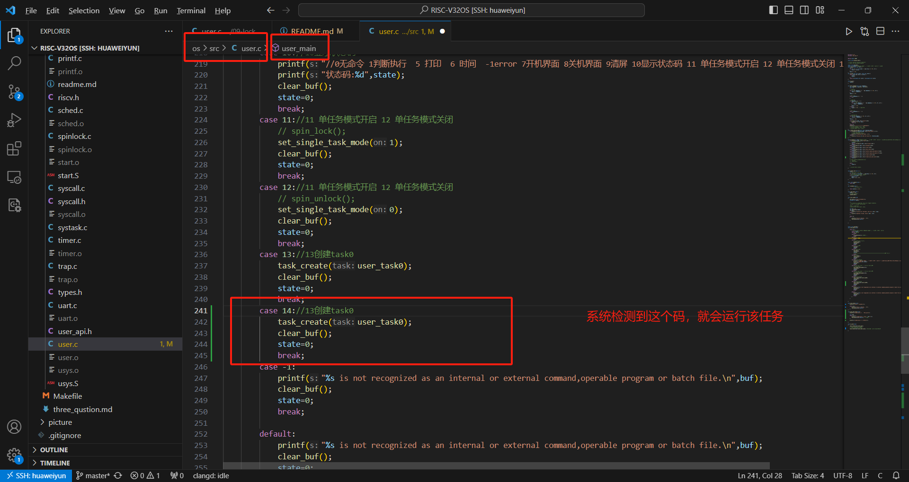
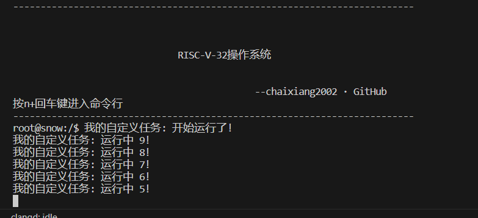
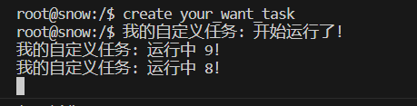

### 项目介绍：

    实现**抢占式多任务调度**的**基于RISC-V架构单核32位操作系统实现**。

    项目文档在/doc/RISCV-OS综合课程设计报告书- - 副本.pdf

##### 12个部分

1. 引导部分
2. uart串口设备
3. 内存管理
4. 上下文切换和协作式多任务
5. Trap和Exception
6. 外部设备中断
7. 硬件定时器
8. 抢占式多任务
9. 任务同步和锁
10. 软件定时器
11. 内核态切换
12. 支持命令行和简单页面

主要技术栈：c语言和RISC-V汇编、Makefile

主要内容：

1. 学习RISC-V指令集架构，正确加载并启动操作系统
2. 通过内存映射控制UART设备实现系统IO
3. 通过PLIC管理中断和异常
4. 通过CLINT实现软硬件定时器。
5. 实现自选锁、内存页分配，任务上下文切换
6. 综合实现抢占式多任务调度

### 环境

1. qemu-system-riscv32
2. riscv64-unknown-elf-gdb
3. riscv64-unknown-elf-gcc
4. riscv64-unknown-elf-objcopy
5. riscv64-unknown-elf-objdump

### 构建并运行（以ubuntu22.04为例）

```bash
apt install gcc-riscv64-unknown-elf
apt install qemu-system-misc
cd ~/os/src
sudo make run
```

##### 运行结果：



成功运行，由于开机默认启动2个任务（体现抢占式多任务）：

1. 命令监听，等待用户输入命令
2. Task1任务，不停打印“Task 1: Running...”

##### 开启单任务模式

```bash
system single_task_mode on
```



我们开启单任务模式，此时只有我们的命令行在运行，其他所有任务都被挂起（并没有结束）。现在我们可以自由的输入命令了

##### 关闭单任务模式

```bash
system single_task_mode off
```

我们可以看到，后台的任务又运行了

##### 创建新任务

```bash
create task0
```



我们可以看到，该命令后都我们创建了Task0这个任务


### 如何让该系统运行用户自己编程写的任务？

##### 提前说明：

- 该系统仅支持C语言和RISCV汇编写的任务。
- 该系统C库并没有完善，如果需要调用标准库，需要自行实现相关库函数。

##### 目前支持的函数

请自行查看os/src/os.h文件，这里的函数可以调用。  

注意引入该头文件，也欢迎各位来丰富我的系统，帮我实现这些库真的很有帮助。




##### 1. 编写自己想要的任务的函数




##### 2. 如何自定义我想要的命令

这里将要我们设置 create your_want_task 命令，实现输入该命令系统自动运行我们刚刚创建的任务。

1. 注册此命令第一步




2. 注册此命令第二步



图这里写错了,正确是这样的

```cpp
		case 14://
			task_create(your_want_task);
			clear_buf();
			state=0;
			break;
```


看看结果，确实开机自启了




再看看命令是否有效，确实有效




更多关于本系统的详细介绍在/doc/RISCV-OS综合课程设计报告书- - 副本.pdf，请自行观看

##### 清除

```bash
cd ~/os/src
make clean
```
